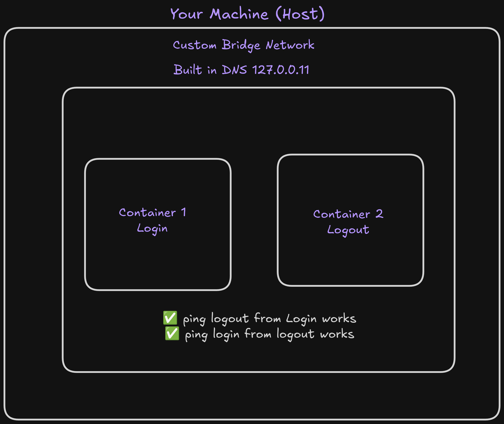
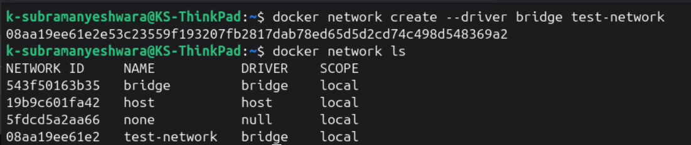
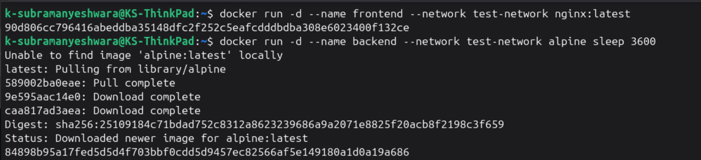
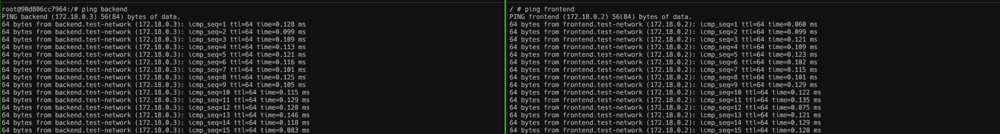
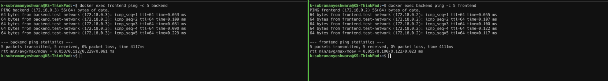
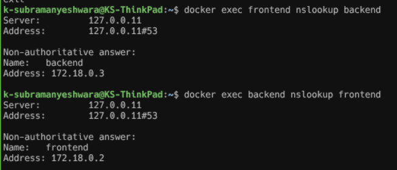

# Custom Bridge Network

In this project, I will create a custom bridge network and run two containers on it.

## Objectives

- Create a custom bridge network.
- Run two containers on it.
- Check the connectivity using container names.

## Prerequisites

- Docker installed on your machine.

## Architecture



## Steps

### Create a custom bridge network

```sh
docker network create --driver bridge test-network
```



### Launch a container on the custom network

```sh
docker run -d --name frontend --network test-network nginx
docker run -d --name backend --network test-network alpine sleep 3600
```



### Check the connectivity using container names

```sh
docker exec -it backend ping frontend
```




### Use nslookup to see how DNS works



#### Installing nslookup on nginx container

```sh
# Enter the container:
docker exec -it <container_name> bash
# Run the installation:
apt update && apt install -y dnsutils
```

### Error

> - docker network create --driver bridge test-network
> - Error response from daemon: network with name test-network already exists
> - It is telling that the network already exists. You can use the existing network or docker rm test-network and create again.

## Outcomes

- Created a custom bridge network.
- Launched two containers on it.
- Checked the connectivity using container names.
- Used nslookup to see how DNS works.

## Key Learnings

- Custom bridge networks provide better isolation and security.
- Containers on the same custom bridge network can communicate using container names.
- DNS resolution is enabled by default in custom bridge networks.

### Author

- [K Subramanyeshwara](https://github.com/ksubramanyeshwara) - Devops and Cloud Engineer.
