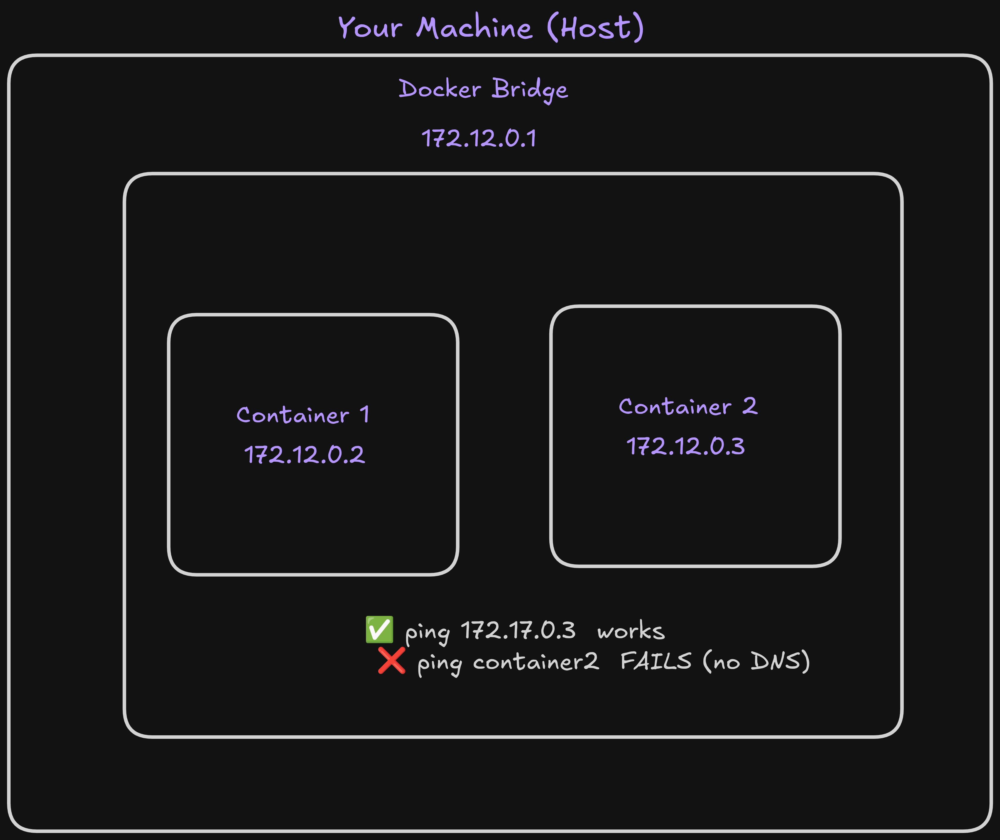
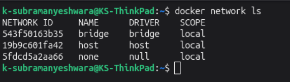
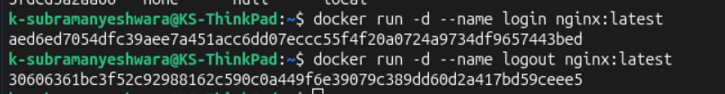
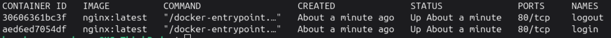
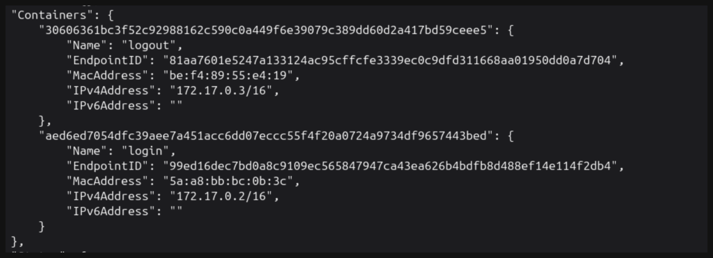
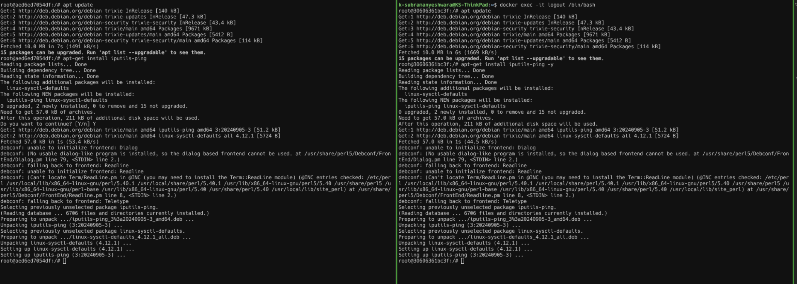
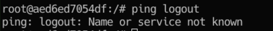
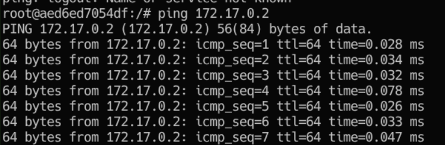

# Default Bridge Network

In this project, I'll create default bridge network and run two containers on it.

## Objectives

- Create a default bridge network.
- Run two containers on it.
- Check the connectivity between them.

## Prerequisites

- Docker installed on your machine.

## Architecture



## Steps

### Inspect the default networks

```sh
docker network ls
```



### Launch two containers on default bridge network

```sh
docker run -d --name login nginx:latest
docker run -d --name logout nginx:latest
```



### Verify they are ruuning

```sh
docker ps
```



### Inspect the bridge network

```sh
docker network inspect bridge
```



### Enter both containers and Install ping

```sh
docker exec -it login /bin/bash
docker exec -it logout /bin/bash

sudo apt install iputils-ping
```



### Try to ping from one container to another by name(Will fail)

```sh
ping logout
ping login
```



### Try to ping from one container to another by IP

```sh
ping 172.17.0.2
ping 172.17.0.3
```



### Clean up

```sh
docker stop login logout
docker rm login logout
```

## Outcomes

- I have successfully created a default bridge network.
- I have successfully run two containers on it.
- I have successfully checked the connectivity between them.

## Key Learnings

- Docker creates a default bridge network when it is installed.
- Docker assigns an IP address to each container on the default bridge network.
- Containers on the default bridge network can communicate with each other using only their IP addresses.

### Author

- [K Subramanyeshwara](https://github.com/ksubramanyeshwara) - Devops and Cloud Engineer.
